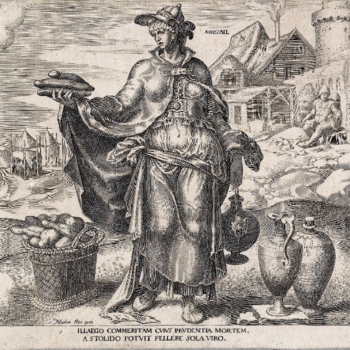
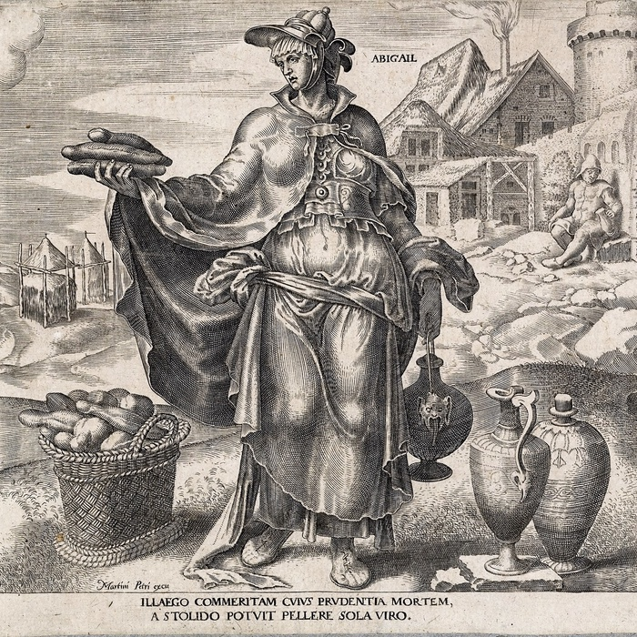

# resizeBenchmark

Vergleich verschiedener Resize-Optionen bei der Skalierung von digitalisierten Kupferstichen.

Bei der Skalierung von Bildern kann es bei feinen Linien und Punkten zu ungewollten Effekten kommen. Der [Moire-Effekt](https://de.wikipedia.org/wiki/Moir%C3%A9-Effekt) ist hier der bekannteste. Da Kupferstiche aus vielen kleinen Linien bestehen ist die Wahl eines geeigneten Verfahrens an der Stelle sehr wichtig. 

## Test

Im Test wurden drei verschiedene Bilder auf 700px verkleinert. 

Folgende Algorithmen wurden im Test berücksichtig:

* Box
* CatmullRom
* Gaussian
* Lanczos
* Linear
* MitchellNetravali
* NearestNeighbor

## Ergebnisse

Eigentlich liefern fast alle Filter, außer NearestNeighbor, ein gutes Ergebnis. Am schärfsten sehen die Kanten bei Lanczos aus.

Beispiele:

NearestNeighbor:

Lanczos:

MitchellNetravali:

Gaussian:

